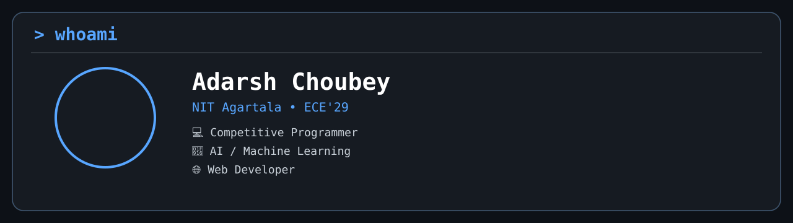

  

  

<!-- Typing Animation -->

<!-- 

# Hi 👋, I'm Adarsh Choubey

### 🎓 NITA'29 | ECE

### 💻 Competitive Programmer • 🤖 AI/ML Enthusiast • 🌐 Web Developer 

 -->

## 🌐 Connect with Me

&nbsp;

&nbsp;

&nbsp;

